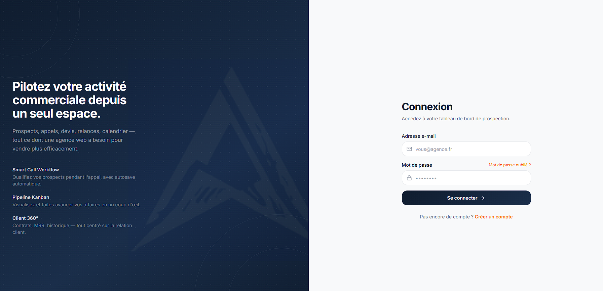
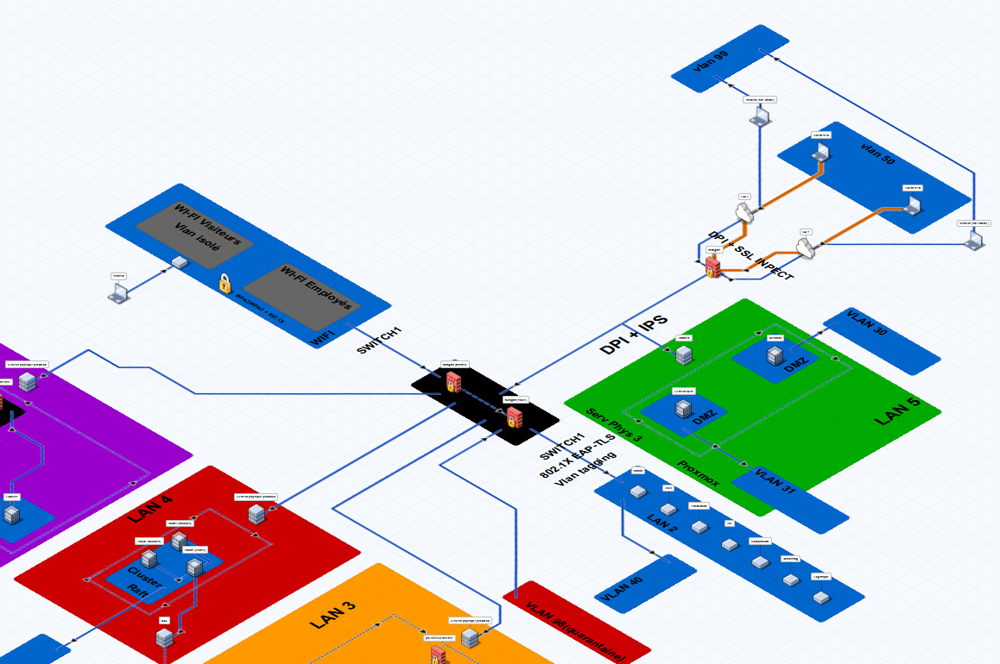
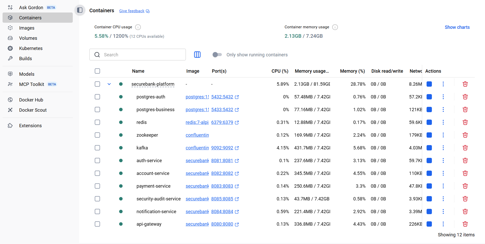
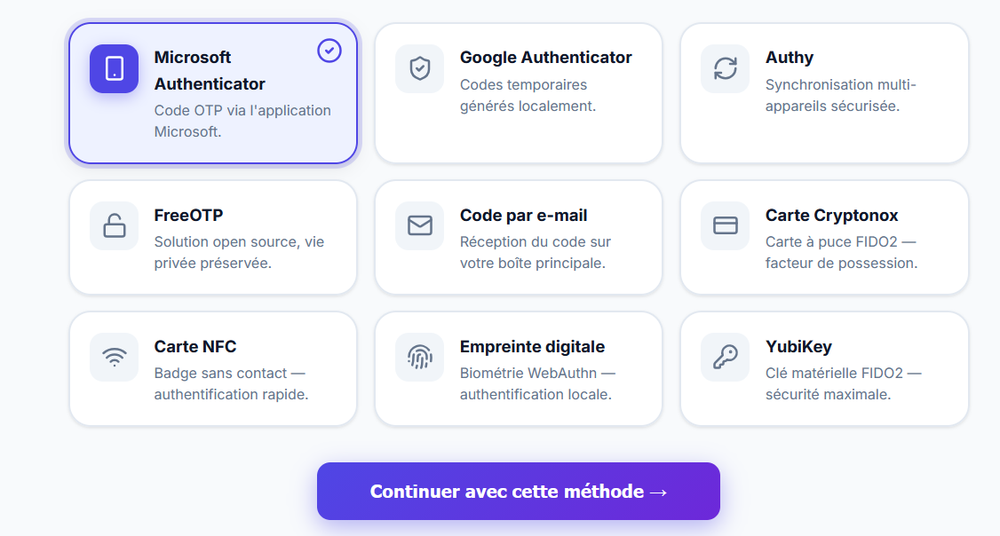
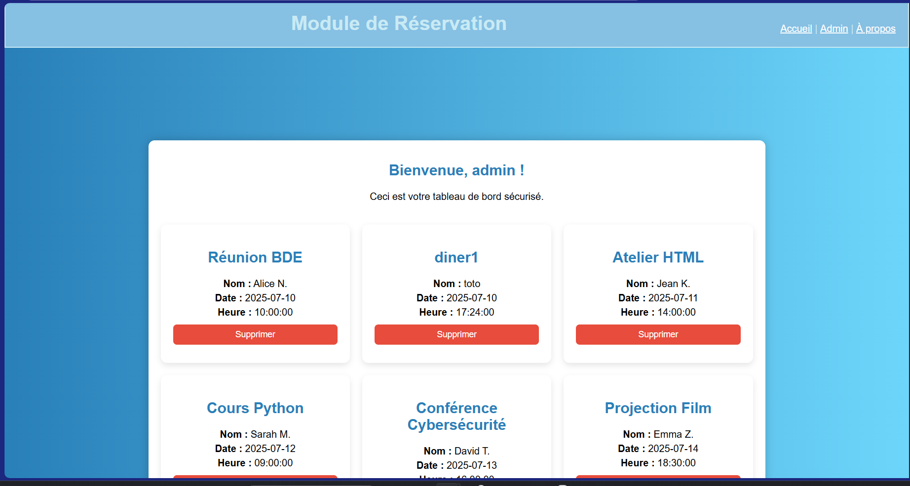
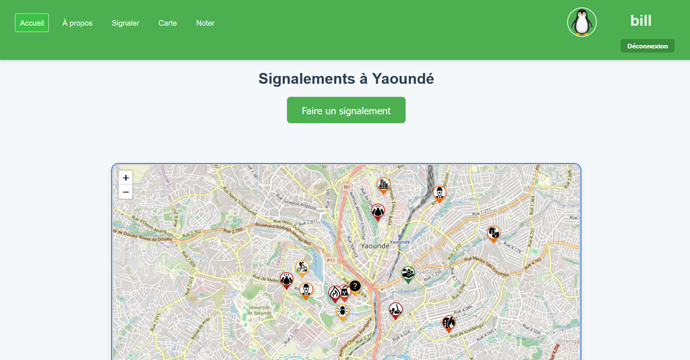
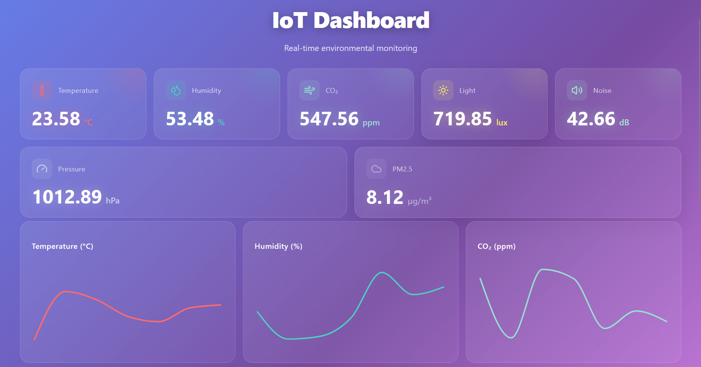

[](README.md)

<div align="center">


<a href="#-profile">
  
</a>

<br/>

<a href="https://www.linkedin.com/in/danol-noumbi-017368333"></a>
<a href="mailto:noumbibe@3il.fr"></a>
<a href="https://github.com/Danol-Noumbi"></a>


</div>


# Profile

### 👋 Hi, I'm **Danol**

🎓 **Computer Engineering Student** <br>
💻 Passionate about **software development** <br>
🔐 Interested in **cybersecurity, networks and infrastructure** <br>
☁️ Curious about **Cloud & DevOps** technologies

> I design modern applications, robust APIs and reliable technical
> architectures, while seeking to understand the security challenges
> that surround them.

---

### 🧑‍💻 Who am I?

<table align="center">
<tr>
<td width="50%">

<h3>🤝 Soft Skills</h3>

- Analytical mindset
- Teamwork
- Autonomy & continuous learning
- Rigor & organization


</td>

<td width="50%">

<h3>🔎 Current search</h3>

Internship in:
- Fullstack
- Cybersecurity
- Systems & Networks

</td>
</tr>

<tr>
<td>

<h3>🛠️ Specializations</h3>

- 💻 Software development
- ☁️ Cloud & DevOps
- 🌐 Networks
- 🔐 Cybersecurity

</td>
<td>

<h3>🌍 Languages</h3>

- 🇫🇷 French — Native
- 🇬🇧 English — TOEIC B2

</td>
</tr>
</table>

---

### 🚀 What interests me

```text
Software Engineering
        │
        ├── 🌐 Web & Mobile
        ├── ⚙️ Backend & API
        └── 🏗️ Software architecture

Infrastructure
        │
        ├── ☁️ Cloud
        ├── 🔄 DevOps / CI-CD
        └── 🌐 Networks

Security
        │
        ├── 🔐 Cybersecurity
        ├── 🖥️ System security
        └── 🛡️ Infrastructure security

```
<br/>

# 🛠️ Tech stack

<!-- Add/remove icons to match your actual stack. Full icon list: https://skillicons.dev -->

**Backend**
<br/>


**Frontend**
<br/>


**Databases**
<br/>


**Cloud & DevOps**
<br/>


**Networks & Security**
<br/>


**Monitoring & Tools**
<br/>


<br/>

# 💼 Professional experience

<table>
<tr>
<td width="70%" align="center">

### 🚀 Full-Stack Developer

**Association Frequencies**

📅 **June 2026 → August 2026**
📍 Limoges, France

</td>
<td width="30%" align="right">


</td>
</tr>
</table>

> Development and maintenance of a **Firebase-based web application** for a cultural association.

**🎯 Responsibilities**

* ✨ Development of new features
* 🐛 Fixing functional bugs
* ♿ Improving accessibility
* 🔄 Working in an **Agile** methodology
* 📋 Project tracking with **Azure DevOps**
* 🌿 Collaboration and code management with **Git**

**🛠️ Technologies**


---

<table>
<tr>
<td width="60%" align="center">

### 🖥️ IT Support (L1)

**CSP Limoges**

📅 **Since September 2025**
📍 Limoges, France

</td>
<td width="40%" align="right">


</td>
</tr>
</table>

> IT support for the staff during **basketball games**, ensuring the smooth operation of equipment and IT services.

**🎯 Responsibilities**

* 🛠️ Keeping scanning equipment operational
* 🔍 Diagnosing and resolving hardware and software incidents
* 👥 User assistance and support
* ⚡ Prioritizing and handling requests
* 💬 Communication with teams and users

<br/>
<br/>

# 🛡️ Academic & personal projects

<table>
<tr>

<td width="65%" valign="top">

<h2>B2B Prospecting CRM</h2>

<strong>May → August 2026</strong> · <code>Full-Stack Web</code>

<blockquote>
A B2B CRM designed to <strong>centralize leads</strong>, track sales interactions and efficiently manage the <strong>prospecting pipeline</strong>.
</blockquote>

<h3>Features</h3>

<table>
<tr>
<td>📊 <strong>KPI Dashboard</strong></td>
<td>Tracking sales metrics</td>
</tr>
<tr>
<td>📋 <strong>Kanban Pipeline</strong></td>
<td>Visual management of opportunities</td>
</tr>
<tr>
<td>📞 <strong>Interactions</strong></td>
<td>Tracking calls and exchanges</td>
</tr>
<tr>
<td>🧾 <strong>Quotes</strong></td>
<td>Managing sales proposals</td>
</tr>
<tr>
<td>📥 <strong>Import</strong></td>
<td>Excel / CSV + duplicate detection</td>
</tr>
<tr>
<td>🔌 <strong>REST API</strong></td>
<td>Frontend / backend communication</td>
</tr>
</table>

</td>

<td width="35%" valign="top" align="center">

<h3>Technologies</h3>


<br><br>

<h3>Preview</h3>



<br><br>


<a href="https://github.com/Danol-Noumbi/crm">
🔗 <strong>View the project on GitHub</strong>
</a>

</td>

</tr>
</table>


---

<table>
<tr>

<td width="65%" valign="top">

<h2>Secure network infrastructure</h2>

<strong>February → April 2026</strong> · <code>Academic project</code>

<blockquote>
Design and deployment of a <strong>secure corporate network infrastructure</strong> for an SME of about 100 users, including network segmentation, traffic control and access security.
</blockquote>

<h3>Architecture & security</h3>

<table>
<tr>
<td>🧩 <strong>Segmentation</strong></td>
<td>Dedicated VLANs for different services</td>
</tr>
<tr>
<td>🛡️ <strong>DMZ</strong></td>
<td>Isolation of services exposed to the network</td>
</tr>
<tr>
<td>🔐 <strong>VPN</strong></td>
<td>Secure remote access to the information system</td>
</tr>
<tr>
<td>🔥 <strong>Firewall</strong></td>
<td>Filtering and control of network traffic</td>
</tr>
<tr>
<td>📝 <strong>Logging</strong></td>
<td>Centralized and traceable actions</td>
</tr>
<tr>
<td>🔑 <strong>Administration</strong></td>
<td>Secure and traceable access</td>
</tr>
<tr>
<td>📐 <strong>Architecture</strong></td>
<td>Design, mockup and technical documentation</td>
</tr>
</table>

</td>

<td width="35%" valign="top" align="center">

<h3>Technologies</h3>


<br><br>

<h3>Architecture</h3>



<br><br>

<a href="#">
🔗 <strong>View documentation</strong>
</a>

</td>

</tr>
</table>

---

<table>
<tr>

<td width="65%" valign="top">

<h2> <a href="https://github.com/Danol-Noumbi/java-library-management">Library Management System</a></h2>

<strong>Java Console Application · OOP & Design Patterns</strong>

<blockquote>
Console-based library management application for handling <strong>books, members, loans, returns, reservations and fines</strong>, with an architecture designed around object-oriented programming and several classic design patterns.
</blockquote>

<h3> Key Features</h3>

<ul>
<li>🧩 <strong>OOP & inheritance</strong> to model book categories and user types</li>
<li>🏭 <strong>Factory</strong> pattern for centralized creation of books, users and reports</li>
<li>🔔 <strong>Observer</strong> pattern to notify members when reservation or overdue-related events occur</li>
<li>🔄 <strong>State</strong> pattern to manage the different states of a book</li>
<li>🧮 <strong>Strategy</strong> pattern to switch between fine calculation methods and search algorithms</li>
<li>🔒 <strong>Singleton & Facade</strong> patterns to centralize library access and simplify interactions with subsystems</li>
<li>💾 <strong>Persistence</strong> with system state saving and loading</li>
</ul>

</td>

<td width="35%" valign="top" align="center">

<h3> Technologies</h3>


<br><br>

<h3> Preview</h3>


<br><br>

<a href="https://github.com/Danol-Noumbi/java-library-management">
🔗 <strong>View project </strong>
</a>

</td>

</tr>
</table>

---

<table>
<tr>

<td width="62%" valign="top">

<h2>Secure microservices architecture</h2>

<strong>November → December 2025</strong> · <code>Backend & Infrastructure</code>

<blockquote>
Design of a <strong>secure, containerized microservices architecture</strong> for a banking platform, including authentication, access control and event-driven communication.
</blockquote>

<h3>⚙️ Key points</h3>

<ul>
<li>🧩 Backend services built with <strong>Spring Boot</strong></li>
<li>🚪 <strong>API Gateway</strong> for API routing and security</li>
<li>🔑 <strong>JWT</strong> authentication and <strong>RBAC</strong> access control</li>
<li>📨 Event-driven communication with <strong>Apache Kafka</strong></li>
<li>🐳 Containerization with <strong>Docker</strong></li>
<li>🚦 API protection with <strong>rate limiting</strong></li>
<li>🔍 Automated security analysis of dependencies, code and Docker images</li>
</ul>

</td>

<td width="38%" valign="top" align="center">

<h3>Technologies</h3>


<br><br>

<h3>Containers</h3>



<br><br>

<a href="https://github.com/Danol-Noumbi/securebank-platform">
🔗 <strong>View the project</strong>
</a>

</td>

</tr>
</table>

---

<table>
<tr>

<td width="65%" valign="top">

<h2>Linux server administration</h2>

<strong>December 2024</strong> · <code>Systems project</code>

<blockquote>
Setup and administration of an <strong>Ubuntu server</strong>, including service configuration, user management and access security.
</blockquote>

<h3>Main tasks</h3>

<ul>
<li>👤 <strong>User, group and permission</strong> management</li>
<li>🔐 <strong>SSH</strong> configuration and hardening</li>
<li>🌐 <strong>Web server</strong> deployment</li>
<li>💾 Setting up <strong>automated backups</strong></li>
<li>📊 <strong>System resource</strong> monitoring</li>
<li>🛠️ Server administration and maintenance</li>
</ul>

</td>

<td width="35%" valign="top" align="center">

<h3>Technologies</h3>


<br><br>

<h3>Skills</h3>

<table>
<tr>
<td align="center">🖥️<br><strong>Administration</strong></td>
<td align="center">🔐<br><strong>Security</strong></td>
</tr>
<tr>
<td align="center">🌐<br><strong>Services</strong></td>
<td align="center">⚙️<br><strong>Automation</strong></td>
</tr>
</table>

</td>

</tr>
</table>


---

<table>
<tr>

<td width="65%" valign="top">

<h2>Strong authentication analysis</h2>

<strong>February - March 2026</strong> · <code>Group project · 3IL Limoges</code>

<blockquote>
Analysis and implementation of <strong>strong authentication methods</strong> within a centralized virtual test environment.
</blockquote>

<h3>Work carried out</h3>

<ul>
<li>🔑 Study of the three authentication factors: <strong>knowledge, possession and inherence</strong></li>
<li>🧪 Analysis and implementation of various authentication methods</li>
<li>🌐 Development and experimentation in a <strong>Web environment</strong></li>
<li>🔐 Hands-on implementation of <strong>FIDO2 / WebAuthn</strong> authentication</li>
<li>🔑 Integration of a <strong>YubiKey</strong> for authentication</li>
<li>🖥️ Testing strong authentication in a <strong>Windows environment</strong></li>
</ul>

<h3>Deliverables</h3>

<ul>
<li>📄 Technical documentation</li>
<li>💻 Dedicated virtual machine for experiments</li>
<li>🔑 <strong>YubiKey</strong> USB authentication</li>
</ul>

</td>

<td width="35%" valign="top" align="center">

<h3>Technologies</h3>


<br><br>



<h3>Factors studied</h3>

<table>
<tr>
<td align="center">🧠<br><strong>What you know</strong></td>
<td align="center">🔑<br><strong>What you have</strong></td>
</tr>
<tr>
<td colspan="2" align="center">👤<br><strong>Who you are</strong></td>
</tr>
</table>

</td>

</tr>
</table>

---

<table>
<tr>

<td width="65%" valign="top">

<h2> <a href="https://github.com/Danol-Noumbi/Reservation">Reservation</a></h2>

<strong>Event booking system</strong>

<blockquote>
Web application for <strong>booking rooms for events</strong>, with a secure admin area to manage reservations.
</blockquote>

<h3>Features</h3>

<ul>
<li>📅 Creating and managing reservations</li>
<li>🔑 Authentication and admin session management</li>
<li>📊 Dashboard to view and manage reservations</li>
<li>🛡️ <strong>CSRF</strong> protection for forms and sensitive actions</li>
<li>🚫 Protection against <strong>brute-force</strong> attempts</li>
<li>🗄️ Prepared SQL queries with <strong>PDO</strong></li>
<li>📱 Responsive interface</li>
</ul>

<h3>Security</h3>

<p>
Implementation of several security mechanisms: <strong>bcrypt</strong>, session fixation protection, CSRF tokens, login attempt limiting and server-side validation.
</p>

</td>

<td width="35%" valign="top" align="center">

<h3>Technologies</h3>


<br><br>

<h3>Preview</h3>



<br>

<a href="https://github.com/Danol-Noumbi/Reservation">
🔗 <strong>View the project</strong>
</a>

</td>

</tr>
</table>

---

<table>
<tr>

<td width="65%" valign="top">

<h2> <a href="https://github.com/Danol-Noumbi/ecommerce-app">Kanope</a></h2>

<strong>Full-stack e-commerce platform</strong>

<blockquote>
Online store built with <strong>Vue.js 3, Node.js/Express and MongoDB</strong>, featuring product management, authentication, admin tools and online payment.
</blockquote>

<h3>Features</h3>

<ul>
<li>🛍️ Product catalog, search and management</li>
<li>👤 Authentication, profiles and order history</li>
<li>🔐 <strong>User / Moderator / Admin</strong> role management</li>
<li>❤️ Wishlist system</li>
<li>🛒 Cart and checkout process</li>
<li>💳 Payments via <strong>Stripe</strong></li>
<li>📧 Email verification and notifications</li>
<li>💬 Messaging system between users</li>
</ul>

<h3>Security</h3>

<p>
<strong>JWT</strong> authentication, passwords protected with <strong>bcrypt</strong>, role-based access control, data validation and HTTP header security with <strong>Helmet</strong>.
</p>

</td>

<td width="35%" valign="top" align="center">

<h3>Technologies</h3>


<br><br>


<a href="https://github.com/Danol-Noumbi/ecommerce-app">
🔗 <strong>View the project</strong>
</a>

</td>

</tr>
</table>


---

<table>
<tr>

<td width="65%" valign="top">

<h2> <a href="https://github.com/Danol-Noumbi/pollution-map">pollution-map</a></h2>

<strong>Pollution reporting and tracking platform</strong>

<blockquote>
Web application allowing citizens to <strong>report and geolocate pollution issues</strong>, while providing administrators with management and analysis tools.
</blockquote>

<h3>Features</h3>

<ul>
<li>📍 Creating and <strong>geolocating reports</strong></li>
<li>🗺️ Interactive mapping with <strong>Leaflet / OpenStreetMap</strong></li>
<li>📸 Adding photos and descriptions to reports</li>
<li>⭐ Rating and comment system</li>
<li>🔔 Status tracking and notifications</li>
<li>📊 <strong>Admin dashboard</strong> with statistics and visualizations</li>
<li>👥 User and report management</li>
</ul>

<h3>Security</h3>

<p>
<strong>JWT</strong> authentication, user/admin permission control, <strong>bcrypt</strong> hashing, data validation and sanitization, <strong>Helmet</strong>, CORS and rate limiting.
</p>

</td>

<td width="35%" valign="top" align="center">

<h3>Technologies</h3>


<br><br>

<h3>Preview</h3>



<br>

<a href="https://github.com/Danol-Noumbi/pollution-map">
🔗 <strong>View the project on GitHub</strong>
</a>

</td>

</tr>
</table>


---

<table>
<tr>
<td width="65%" valign="top">

<h2> <a href="https://github.com/Danol-Noumbi/IoT-Dashboard">IoT-Dashboard</a></h2>

<strong>IoT project · Data collection, visualization & monitoring</strong>

<blockquote>
Containerized IoT platform for <strong>generating, storing and visualizing environmental data</strong> through a multi-service architecture orchestrated with Docker Compose.
</blockquote>

<h3>Features</h3>
<ul>
<li>🌡️ Sensor data generation: temperature, humidity, CO₂, noise, pressure, PM2.5...</li>
<li>🔌 REST API for data access</li>
<li>📊 React dashboard with data visualization</li>
<li>🗄️ Persistent storage with <strong>PostgreSQL</strong></li>
<li>📈 Backend monitoring with <strong>Prometheus</strong></li>
<li>📉 Visualization and analysis with <strong>Grafana</strong></li>
<li>🐳 Multi-service architecture orchestrated with <strong>Docker Compose</strong></li>
<li>🔄 CI pipeline with tests, Docker builds and image publishing</li>
</ul>

</td>

<td width="35%" valign="top" align="center">

<h3>Technologies</h3>


<br><br>

<h3>Architecture</h3>



<br>

<a href="https://github.com/Danol-Noumbi/IoT-Dashboard">
🔗 <strong>View the project</strong>
</a>

</td>
</tr>
</table>

# Education & Certifications

<table>
<tr>
<td width="55%" valign="top">

<h3>🏛️ Academic background</h3>

<strong>Computer Engineering Program</strong><br>
3IL Ingénieurs · Limoges<br> <em>Since September 2025</em>

<p>
Software development · Cloud Computing · DevOps · Networks & Cybersecurity · Systems administration · Agile project management
</p>

<h3>🧪 Hands-on practice</h3>

<ul>
<li>🔐 <strong>Root-Me</strong> — Web, Networks, Cryptography, Systems & Programming challenges</li>
<li>🛡️ <strong>PortSwigger Web Security Academy</strong> — Hands-on Web security labs</li>
<li> 🎯 <strong>TryHackMe</strong> — Learning paths and hands-on machines to build cybersecurity and penetration testing skills</li>
<li> 🔑 <strong>CryptoHack</strong> — Hands-on challenges dedicated to cryptography and the analysis of cryptographic mechanisms</li>
</ul>

</td>

<td width="45%" valign="top">

<h3>📜 Certifications & training</h3>

<p>
🛡️ <strong>SecNumAcadémie — ANSSI</strong>
<em>Certificate of completion · February 2026</em><br>
MOOC covering the fundamentals of information systems security, authentication, Internet security and workstation security
</p>

<table>
<tr>
<td>Information systems security</td>
<td align="center"><strong>88%</strong></td>
</tr>
<tr>
<td>Authentication</td>
<td align="center"><strong>90%</strong></td>
</tr>
<tr>
<td>Internet security</td>
<td align="center"><strong>92%</strong></td>
</tr>
<tr>
<td>Workstation & remote work security</td>
<td align="center"><strong>96%</strong></td>
</tr>
</table>

<br>

<p>
📊 <strong>Data Science & Machine Learning I MasterClass — Python</strong>
<em>Udemy · 44.5 h · March 2025</em><br>
44.5-hour training on Data Science and Machine Learning with Python
</p>

<p>
🔐 <strong>Introduction to Cybersecurity</strong> - in progress<br>
<em>Cisco</em>
</p>

<p>
🌐 <strong>Coursera</strong>
Hands-on courses in HTML, CSS, JavaScript, Web interface development and client-side applications

</td>
</tr>
</table>


<div align="center" >
<h2 align="center"><strong>Available for an internship starting in January 2027</strong> </h2>


</div>
