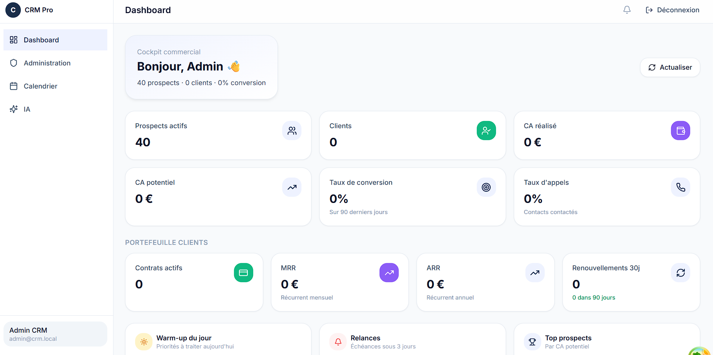

<div align="center">


<a href="#-profil">
  
</a>

<br/>

<a href="https://www.linkedin.com/in/danol-noumbi-017368333"></a>
<a href="mailto:noumbibe@3il.fr"></a>
<a href="https://github.com/Danol-Noumbi"></a>


</div>


## Profil

### 👋 Bonjour, moi c'est **Danol**

🎓 **Étudiant Ingénieur Informatique**  
💻 Passionné par le **développement logiciel**  
🔐 Intéressé par la **cybersécurité, les réseaux et les infrastructures**  
☁️ Curieux des technologies **Cloud & DevOps**

> Je conçois des applications modernes, des API robustes et des architectures
> techniques fiables, tout en cherchant à comprendre les problématiques de
> sécurité qui les entourent.

---

### 🧑‍💻 Qui suis-je ?

<table align="center">
<tr>
<td width="50%">

**🎓 Formation**

Cycle Ingénieur Informatique  
**3IL Ingénieurs · Limoges**

</td>
<td width="50%">

**🔎 Recherche actuelle**

Stage en :
- Fullstack
- Cybersécurité
- Systèmes & Réseaux

</td>
</tr>

<tr>
<td>

**🛠️ Spécialisations**

- 💻 Développement logiciel
- ☁️ Cloud & DevOps
- 🌐 Réseaux
- 🔐 Cybersécurité

</td>
<td>

**🌍 Langues**

- 🇫🇷 Français — Natif
- 🇬🇧 Anglais — TOEIC B2

</td>
</tr>
</table>

---

### 🚀 Ce qui m'intéresse

```text
Software Engineering
        │
        ├── 🌐 Web & Mobile
        ├── ⚙️ Backend & API
        └── 🏗️ Architecture logicielle

Infrastructure
        │
        ├── ☁️ Cloud
        ├── 🔄 DevOps / CI-CD
        └── 🌐 Réseaux

Security
        │
        ├── 🔐 Cybersécurité
        ├── 🖥️ Sécurité des systèmes
        └── 🛡️ Sécurité des infrastructures

```
<br/>

## 🛠️ Stack technique
 
<!-- Ajoute/retire les icônes selon ta stack réelle. Liste complète des icônes disponibles : https://skillicons.dev -->
 
**Backend**
<br/>

 
**Frontend**
<br/>

 
**Bases de données**
<br/>

 
**Cloud & DevOps**
<br/>

 
**Réseaux & Sécurité**
<br/>


 
**Supervision & Outils**
<br/>


<br/>

## 💼 Parcours professionnel

<table>
<tr>
<td width="70%" align="center">

### 🚀 Développeur Full-Stack

**Association Frequencies**

📅 **Juin 2026 → Août 2026**
📍 Limoges, France

</td>
<td width="30%" align="right">


</td>
</tr>
</table>

> Développement et maintenance d'une **application web basée sur Firebase** pour une association culturelle.

**🎯 Missions**

* ✨ Développement de nouvelles fonctionnalités
* 🐛 Correction de bugs fonctionnels
* ♿ Amélioration de l'accessibilité
* 🔄 Travail en **méthode Agile**
* 📋 Gestion du projet avec **Azure DevOps**
* 🌿 Collaboration et gestion du code avec **Git**

**🛠️ Technologies**


---

<table>
<tr>
<td width="60%" align="center">

### 🖥️ Support Informatique ( N1 )

**CSP Limoges**

📅 **Depuis Septembre 2025**
📍 Limoges, France

</td>
<td width="40%" align="right">


</td>
</tr>
</table>

> Support informatique auprès des équipes lors des **matchs de basketball**, avec pour objectif d'assurer le bon fonctionnement des équipements et services informatiques.

**🎯 Missions**

* 🛠️ Maintien en condition opérationnelle des équipements de scan
* 🔍 Diagnostic et résolution d'incidents matériels et logiciels
* 👥 Assistance et accompagnement des utilisateurs
* ⚡ Priorisation et traitement des demandes
* 💬 Communication avec les équipes et utilisateurs

<br/>

## 🛡️ Projets académiques & personnels

<table>
<tr>
<td width="70%" valign="top">

## 📇 CRM Prospection B2B

**Mai → Août 2026** · `Full-Stack Web`

> CRM B2B conçu pour **centraliser les prospects**, suivre les interactions commerciales et piloter efficacement le **pipeline de prospection**.

### ✨ Fonctionnalités

|                          |                                               |
| ------------------------ | --------------------------------------------- |
| 📊 **Dashboard KPI**     | Suivi des indicateurs commerciaux             |
| 📋 **Pipeline Kanban**   | Gestion visuelle des opportunités             |
| 📞 **Interactions**      | Suivi des appels et échanges                  |
| 🧾 **Devis**             | Gestion des propositions commerciales         |
| 📥 **Import de données** | Excel / CSV avec détection des doublons       |
| 🔌 **API REST**          | Communication entre le frontend et le backend |

</td>

<td width="30%" valign="top" align="center">

### 🛠️ Stack


</td>
</tr>

<tr >



<br><br>

<a href="https://github.com/Danol-Noumbi/crm">
  🔗 <b>Voir le projet</b>
</a>

</tr>

</table>


---

### 🌐 Infrastructure réseau sécurisée

**Février → Avril 2026** · *Projet académique*

Conception d'une **architecture réseau sécurisée pour une PME d'environ 100 utilisateurs**, avec segmentation du réseau et contrôle des flux.

* 🧩 Segmentation réseau par **VLAN**
* 🛡️ Mise en place d'une **DMZ**
* 🔐 Accès distant sécurisé via **VPN**
* 📝 Centralisation et analyse des journaux
* 🔑 Sécurisation des accès administrateurs
* 📐 Documentation de l'architecture et des flux réseau

**Technologies :**
`Fortinet` `VLAN` `VPN` `DMZ` `Réseaux` `Sécurité`

---

### 🔐 Architecture microservices sécurisée

**Novembre → Décembre 2025** · *Projet Backend & Infrastructure*

Conception d'une architecture **microservices conteneurisée**, avec authentification et sécurisation des échanges entre services.

* 🧩 Développement de services backend avec **Spring Boot**
* 🔑 Authentification basée sur **JWT / OAuth2**
* 🐳 Conteneurisation avec **Docker**
* 🔒 Sécurisation des communications inter-services
* 🔄 Mise en place d'une chaîne **CI/CD**
* 🔐 Gestion des secrets et de la configuration

**Technologies :**
`Java` `Spring Boot` `Docker` `React` `JWT` `OAuth2` `CI/CD`

---

### 🐧 Administration d'un serveur Linux

**Novembre → Décembre 2025** · *Projet Systèmes*

Mise en place et administration d'un **serveur Ubuntu**, avec configuration des services, gestion des utilisateurs et sécurisation des accès.

* 👤 Gestion des utilisateurs, groupes et permissions
* 🔐 Configuration et sécurisation de **SSH**
* 🌐 Déploiement d'un serveur web
* 💾 Mise en place de sauvegardes automatisées
* 📊 Supervision des ressources système
* 🛠️ Administration et maintenance du serveur

**Technologies :**
`Linux` `Ubuntu` `SSH` `Bash` `Administration système`

---

## 🚀 Projets phares · GitHub

### 🔐 [Reservation](https://github.com/Danol-Noumbi/Reservation)

**Système de réservation d'événements**

Application web permettant aux utilisateurs de **réserver des salles pour des événements**, avec un espace d'administration sécurisé pour gérer les réservations.

* 📅 Création et gestion des réservations
* 🔑 Authentification administrateur
* 🛡️ Protection **CSRF** des formulaires
* 🔒 Hachage des mots de passe avec **bcrypt**
* 🚫 Protection contre les attaques par **brute-force**
* 🗄️ Requêtes SQL préparées avec **PDO**
* 📱 Interface responsive et tableau de bord administrateur

**Technologies :**
`PHP` `MySQL` `PDO` `JavaScript` `HTML5` `CSS3`

---

### 🏆 [Compétition sportive](https://github.com/Danol-Noumbi/Comp-tition-sportive)

**Application web de gestion d'un événement sportif · Projet de groupe**

Projet collaboratif visant à développer une application web dédiée à la **gestion d'un événement sportif**. Le dépôt contient notamment une base Java/Gradle et une architecture de projet structurée.

**Technologies :**
`Java` `Gradle` `Web`

---

### 🛒 [ecommerce-app](https://github.com/Danol-Noumbi/ecommerce-app)

**Kanope · Plateforme e-commerce**

Plateforme e-commerce full-stack avec **Vue.js, Node.js/Express et MongoDB**, intégrant authentification, gestion des produits, favoris, administration et paiement via Stripe.

* 🛍️ Gestion et consultation des produits
* 👤 Authentification et gestion des profils
* 🔐 Système de rôles **User / Moderator / Admin**
* ❤️ Gestion des favoris
* 💳 Intégration **Stripe**
* 📧 Vérification d'adresse e-mail
* 💬 Système de messagerie
* 🛡️ JWT, bcrypt, Helmet et validation des données

**Technologies :**
`Vue.js` `Node.js` `Express.js` `MongoDB` `Mongoose` `JWT` `Stripe`

---

### 🌍 [pollution-map](https://github.com/Danol-Noumbi/pollution-map)

**Plateforme de signalement et de suivi de la pollution**

Application web permettant aux citoyens de **signaler des problèmes de pollution**, de les géolocaliser et de suivre leur traitement. Elle comprend également un espace d'administration et des outils d'analyse.

* 📍 Géolocalisation des signalements
* 🗺️ Cartographie interactive avec **Leaflet / OpenStreetMap**
* 📸 Ajout de photos aux signalements
* ⭐ Système de notation et commentaires
* 📊 Dashboard d'administration et statistiques
* 🔐 Authentification JWT et gestion des rôles
* 🛡️ Protection des API avec Helmet, CORS et rate limiting
* ⚡ Optimisations backend et frontend

**Technologies :**
`Vue.js` `Node.js` `Express.js` `MongoDB` `Mongoose` `JWT` `Leaflet` `OpenStreetMap`

---

### 📡 [IoT-Dashboard](https://github.com/Danol-Noumbi/IoT-Dashboard)

**Plateforme IoT conteneurisée · Monitoring temps réel**

Infrastructure IoT permettant de **générer, stocker et visualiser des données environnementales**, avec une architecture multi-services entièrement orchestrée par Docker Compose.

* 🌡️ Collecte de données : température, humidité, CO₂, bruit, pression, PM2.5...
* 🔌 API REST pour l'accès aux données
* 📊 Dashboard React avec visualisation temps réel
* 🗄️ Stockage persistant avec **PostgreSQL**
* 📈 Monitoring backend avec **Prometheus**
* 📉 Dashboards et analyse avec **Grafana**
* 🐳 Orchestration de l'ensemble avec **Docker Compose**
* 🔄 Pipeline CI avec tests, builds Docker et publication d'images

**Technologies :**
`React` `Node.js` `PostgreSQL` `Docker` `Docker Compose` `Prometheus` `Grafana`


